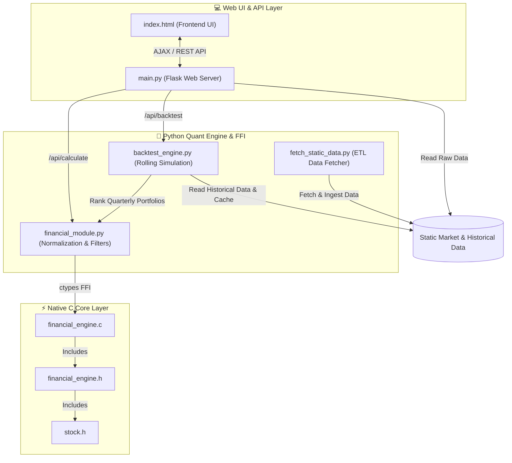

# ארכיטקטורת הפרויקט - תרשים זרימה

להלן תרשים התלויות והזרימה של המערכת:

```mermaid
graph TD
    %% Subgraph 1: UI & Web Layer
    subgraph Web_Layer["💻 Web UI & API Layer"]
        HTML["index.html (Frontend UI)"]
        FlaskServer["main.py (Flask Web Server)"]
    end

    %% Subgraph 2: Python Engine & Backtest Layer
    subgraph Python_Layer["🐍 Python Quant Engine & FFI"]
        FinModule["financial_module.py (Normalization & Filters)"]
        BacktestEngine["backtest_engine.py (Rolling Simulation)"]
        FetchData["fetch_static_data.py (ETL Data Fetcher)"]
    end

    %% Subgraph 3: Static Data Node
    StaticData[("Static Market & Historical Data")]

    %% Subgraph 4: Native C Engine
    subgraph C_Layer["⚡ Native C Core Layer"]
        FinEngineC["financial_engine.c"]
        FinEngineH["financial_engine.h"]
        StockH["stock.h"]
    end

    %% Links - Web Layer
    HTML <-->|AJAX / REST API| FlaskServer
    FlaskServer -->|/api/calculate| FinModule
    FlaskServer -->|/api/backtest| BacktestEngine
    FlaskServer -->|Read Raw Data| StaticData

    %% Links - Python & Backtest Layer
    BacktestEngine -->|Rank Quarterly Portfolios| FinModule
    BacktestEngine -->|Read Historical Data & Cache| StaticData
    
    FetchData -->|Fetch & Ingest Data| StaticData

    %% Links - Python to C FFI
    FinModule -->|ctypes FFI| FinEngineC

    %% Links - C Dependencies
    FinEngineC -->|Includes| FinEngineH
    FinEngineH -->|Includes| StockH
```

